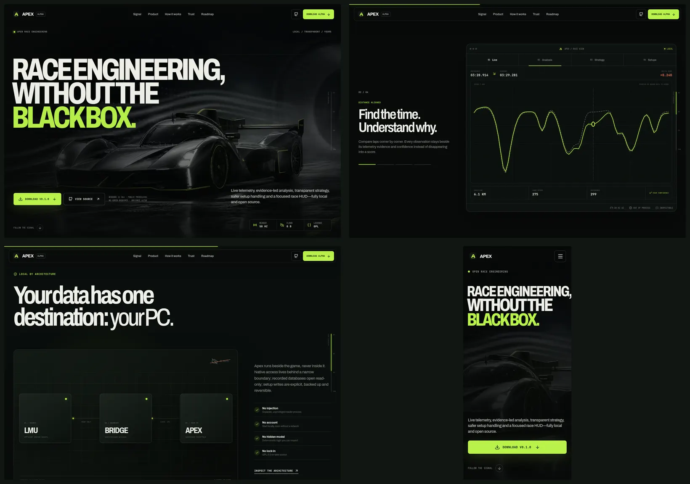

# Apex marketing site

A motion-led landing page for [Apex](https://github.com/ralfboltshauser/apex-lmu), the free, local-first, open-source race engineering companion for Le Mans Ultimate.



## What this is

The site turns Apex's product truth into one continuous race narrative:

- an instant AVIF wind-tunnel hero with restrained scroll parallax, aero flow, and a telemetry reticle;
- a native-scroll lap progression with sector markers instead of scroll hijacking;
- a pinned product theatre for Live, Analysis, Strategy, and Setups;
- real pointer- and keyboard-scrubbable telemetry, selectable race postures, and setup previews;
- a CSS 3D local-architecture explainer;
- explicit validation scope, alpha boundaries, checksum guidance, and install choices;
- a complete mobile navigation, install path, FAQ, and reduced-motion experience.

GO Fast informed the product-story hierarchy. MotionSites informed the motion grammar: one visual world, one semantic progress signal, a pinned stage, typography used as geometry, and quiet pointer response layered under scroll choreography. No GO Fast visuals, UI, branding, testimonials, or proprietary assets are used.

## Run locally

Requires Node.js 20 or newer.

```bash
npm install
npm run dev
```

The dev server binds to `0.0.0.0` so the page can also be opened from another machine on the local network.

Production checks:

```bash
npm run typecheck
npm run build
npm run preview
```

## Performance decisions

- The 55 KiB AVIF poster is the hero's first paint and LCP candidate.
- The hero is a 55 KiB AVIF with a WebP fallback; there is no WebGL runtime or 3D payload.
- Scroll-linked hero work is limited to compositor transforms and opacity.
- Product screenshots are AVIF; fonts are self-hosted; there are no runtime CDN, analytics, tracking, cookie, or cloud requests.
- Scroll and pointer paths update element transforms directly. They do not drive descendants through root-level CSS variables.

## Accessibility and input

- Semantic landmarks, a skip link, visible focus treatment, native buttons/links, and 44 px-class touch targets.
- Product views use tabs; the telemetry chart is an ARIA slider and responds to pointer input or arrow keys.
- The mobile menu is modal, makes background content inert, restores the page on close, and closes with Escape.
- `prefers-reduced-motion` replaces the pinned choreography with a static poster and normal document flow.
- Decorative hover motion is limited to fine pointers. Essential content never depends on hover.
- Axe Core reports zero automated violations in the tested desktop and mobile states.

## Original visual assets

All hero imagery was created for this project; no downloaded stock vehicle or track asset is shipped.

- `public/media/hero-windtunnel.avif` — generated in the built-in image generator's stylized-concept mode: an original graphite endurance prototype in a black wind tunnel, acid-lime flow lines, silver highlights, no text, logos, real livery, or identifiable production car.
- `public/media/signal-circuit.avif` — generated in stylized-concept mode: an abstract top-down endurance circuit whose lime racing line becomes a telemetry waveform and engineering grid, with no text, logos, or real circuit geometry.
The unoptimized generation sources and reference captures live under the git-ignored `research/` directory.

## Product accuracy

The page deliberately calls v0.1.0 a public alpha. It does not claim current real-game compatibility. The validation panel distinguishes deterministic demo and package lifecycle coverage from still-open LMU, EAC, fullscreen, continuous recording, and analysis-ingestion work.

The download URLs target the explicit v0.1.0 prerelease because GitHub prereleases do not populate the normal `releases/latest` endpoint.

## License

GPL-3.0-or-later. Apex is a community project and is not affiliated with Studio 397 or Le Mans Ultimate.
