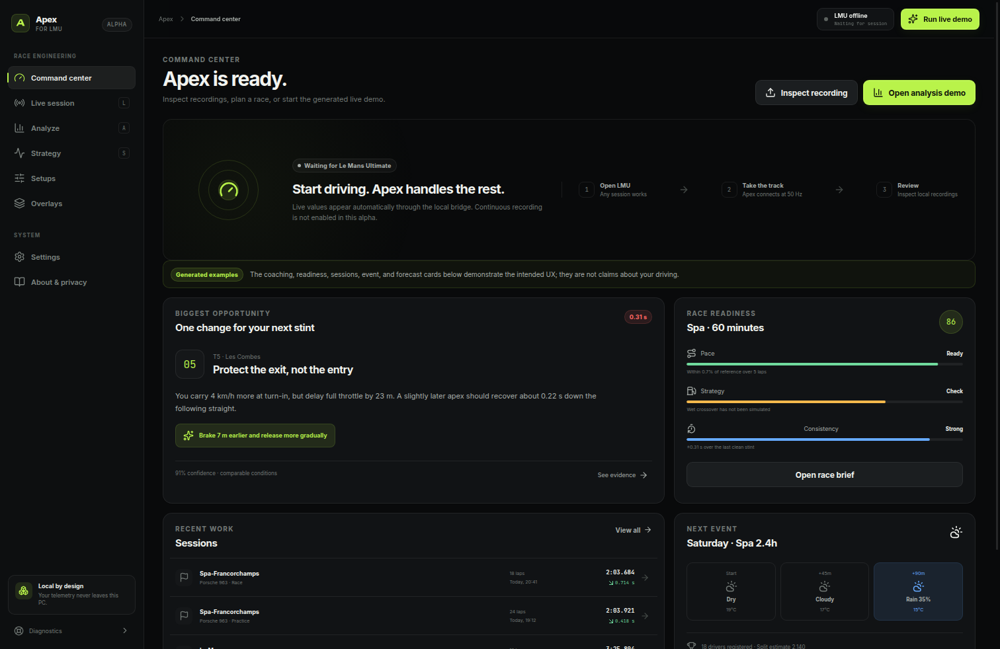
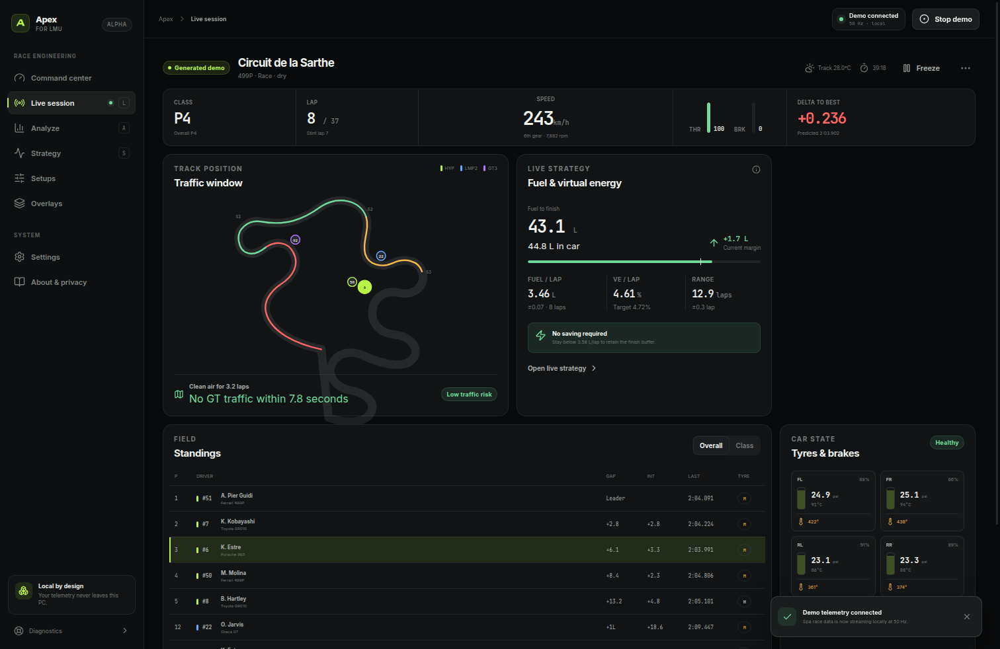
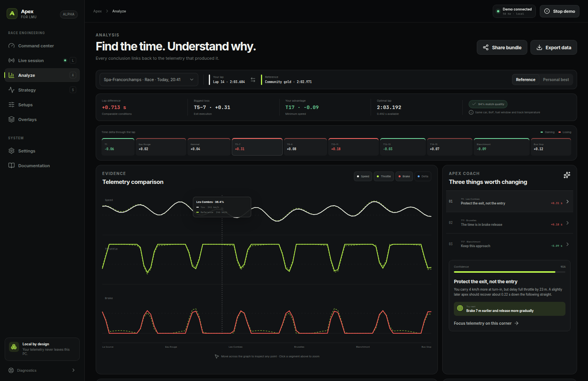
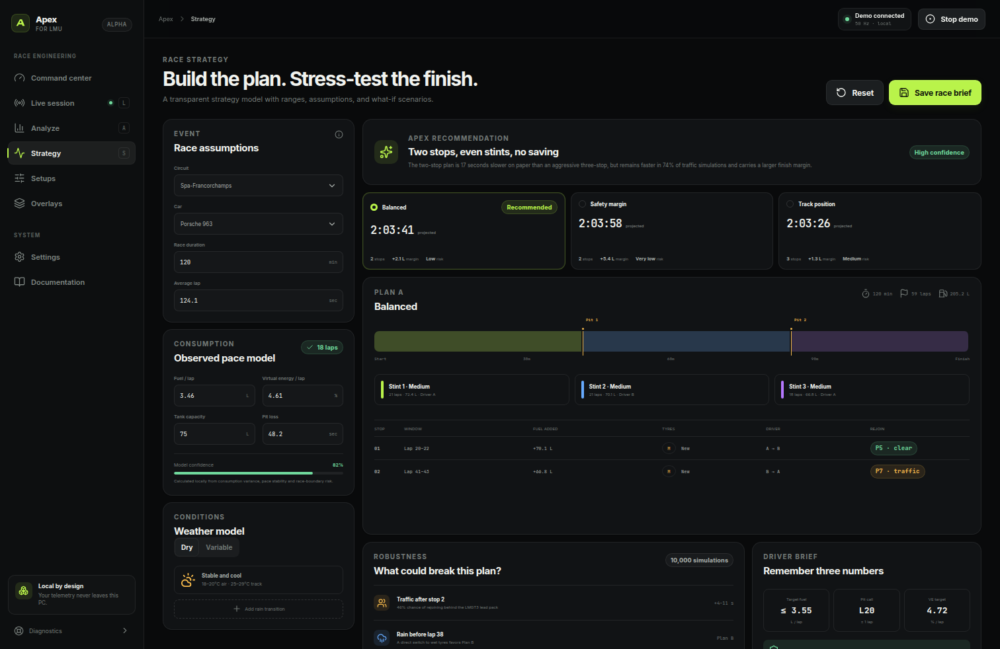
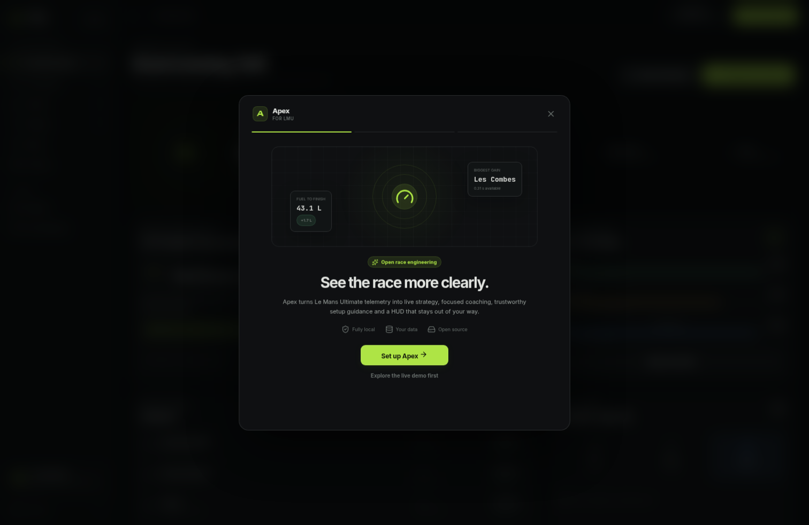

<p align="center">
  
</p>

<h1 align="center">Apex for LMU</h1>

<p align="center">
  Local-first race engineering for Le Mans Ultimate.<br>
  Live telemetry, strategy, analysis, setup safety and a click-through HUD — no account and no cloud.
</p>

<p align="center">
  <a href="https://github.com/ralfboltshauser/apex-lmu/actions/workflows/ci.yml"></a>
  <a href="https://github.com/ralfboltshauser/apex-lmu/releases"></a>
  <a href="LICENSE"></a>
  
  
  <a href="https://apex-lmu.openexp.dev"></a>
</p>



> [!IMPORTANT]
> Apex is a public alpha. The app, native bridge, packaging and deterministic
> Windows fixture path are tested, but compatibility with a current installed
> LMU build has not yet been established. Generated examples are labeled in the
> UI and are never presented as a player's measured data.

## Install

Windows 11 x64 is the currently tested target. Neither build requires
administrator privileges.

1. Download the **[latest Windows installer](https://github.com/ralfboltshauser/apex-lmu/releases/latest)**.
2. Run it and open **Apex for LMU**.
3. Start LMU and enter a session. Apex detects the selected car, track and
   environment from the garage/pre-race pit lane, then adds full vehicle data
   as soon as LMU publishes it. Apex waits locally for LMU's shared-memory
   interface; it does not inject anything into the game.

A portable ZIP and SHA-256 checksums
are attached to every release.

The alpha installer is unsigned, so Windows SmartScreen may show a warning.
Verify the checksum before running it. Code signing is a release-roadmap item.

### First run and troubleshooting

The first-run wizard verifies the LMU installation path and runs the bundled bridge's isolated protocol self-test before calling the integration ready. The self-test does not require LMU to be running. Apex can show session, selected car, standings and weather as soon as LMU exposes scoring in the garage or pre-race pit lane. Fuel, controls, tyres and brakes appear only when LMU activates the player's vehicle-telemetry block; Apex labels that boundary instead of displaying invented zeroes.

After onboarding, each workspace introduces itself once and keeps a **Learn this view** guide available. These guides explain the recommended flow, define unfamiliar race-engineering terms, and state what a useful outcome looks like. Settings → About can replay onboarding or reset all introductions without deleting user data.

Apex ships with complete English and German interfaces. Use the **EN/DE** control in the top bar for an instant switch, or choose the interface language under **Settings → About**. The preference stays on this PC, German browser/Windows locales default to German, and technical support logs remain unchanged so diagnostics are searchable and shareable.

If connection or setup fails, open **Settings → Diagnostics**:

- Run read-only platform, storage, bridge, and protocol checks.
- Expand a failed check for a targeted fix and its complete technical details.
- View or copy the rotating local JSONL error log.
- Open the log directory or export a support bundle for a GitHub issue.

Support bundles contain Apex version/system metadata, diagnostic results, and Apex process/bridge logs. They exclude telemetry frames and setup contents, redact the user's home directory and common secret fields, and are plain JSON so they can be reviewed before sharing.

LMU discovery uses Steam app ID `2399420`. Apex reads Steam's registry location, parses `steamapps/libraryfolders.vdf` for secondary libraries, and confirms the installation through `appmanifest_2399420.acf` and the game executable. If automatic discovery fails, onboarding and Settings show every attempted path and expectation; use Steam's **Properties → Installed Files → Browse** action to paste or choose the exact game folder manually. The discovery trace is also included in local diagnostic logs and support bundles.

### Updating Apex

Installed Windows builds check the public GitHub release channel shortly after startup. Apex shows an in-app notification when a newer alpha is available, but does not download it without confirmation. Open **Settings → Application updates** to check manually, review release notes, monitor download progress, and choose when to restart and install. Update metadata includes the installer SHA-512 digest used by `electron-updater`; updater events and errors are captured in the local support log.

Portable ZIP builds cannot reliably replace their own running directory. They retain a **Releases** fallback that opens the exact public download page; running the per-user installer requires no administrator rights and preserves the existing Apex user-data directory.

## What works today

| Area | Current behavior |
| --- | --- |
| Live session | Reads the `LMU_Data` mapping out of process; shows car/session/weather/standings before the race, then measured position, laps, speed, controls, fuel, hybrid state, tyres and brakes when player telemetry becomes available. |
| Track & braking | Reconstructs the measured driven line locally from official world coordinates, places measured cars, detects stable brake zones, and links map/text/speed/brake evidence by LMU lap distance. It does not claim surveyed track limits or invented corner names. |
| Lifetime activity | Durably tracks local-player driving distance by raw LMU vehicle name/class with idempotent SQLite checkpoints, recovery, verified backups and replay/AI/demo exclusion. |
| Session recorder | One-click raw `.apexrec` capture starts before LMU and records every official shared-memory snapshot at 50 Hz. Normal Replay runs the current decoder without the game but stays transient: it feeds Live, the overlay and Analysis during the current app run, but never writes durable Analysis history or lifetime statistics. Files remain local and are explicitly user-shared. See [recording format and workflow](docs/RECORDINGS.md). |
| Fuel calculator | Manual timed/lap planning plus automatic clean-lap consumption capture. Excludes pit/refuel laps, retains car/track samples locally, protects timed extra-lap boundaries, and reports total fuel, starting load, stops, final stint, reserve and confidence. |
| Overlay | Separate transparent, always-on-top, click-through Electron window with stale-data clearing when LMU disconnects. |
| Recorded telemetry | Opens LMU DuckDB files read-only and indexes metadata, tables, channels, events, laps and lap times. Converting those channels into full analysis traces is not implemented yet. |
| Analysis | Finalized live laps survive restarts within bounded local retention. An explicit private `.apexrec` import runs strict current-decoder replay into isolated staging, then commits validated sessions atomically. A matching recording/processing version is a no-op while its complete imported batch remains retained; re-import can restore a batch later reduced by bounded retention without duplicating retained rows. The factual debrief uses complete clean and limited official times for pace while reserving PB/comparison-reference and learned-track sources for the stricter reference-eligible clean set. Generated fixtures remain visibly labeled and separate. |
| Strategy | Deterministic manual fuel-only candidates with integer-lap stints and pit/refuel time coupled back into timed-race distance. VE, tyres, traffic, weather and driver rules are explicitly not modeled until verified inputs exist. |
| Setups | Imports `.svm` files only into LMU settings folders, creates durable collision backups, handles read-only files and rolls back a failed replacement. |
| Demo | Seeded multiclass telemetry makes every workflow explorable without LMU or a network connection. |

Native LMU DuckDB channel-to-trace ingestion, real community content and
freeform overlay positioning are deliberately still marked unavailable.

The finite shipped/rejected scope—including why cloud, “pro” data and
fixture-less import/setup features are not claimed—is documented in the
**[capability and provenance matrix](docs/CAPABILITIES.md)**.

## Designed to be useful at 280 km/h

<table>
  <tr>
    <td width="50%">
      <br>
      <sub><strong>Live pit wall.</strong> Traffic, resources, standings and car state in one glance. Screenshot uses the generated demo.</sub>
    </td>
    <td width="50%">
      <br>
      <sub><strong>Explain the lap.</strong> Generated fixture traces keep the conclusion next to the evidence and confidence that produced it.</sub>
    </td>
  </tr>
  <tr>
    <td width="50%">
      <br>
      <sub><strong>Stress-test the finish.</strong> User-editable example assumptions, alternative plans and explicit failure scenarios.</sub>
    </td>
    <td width="50%">
      <br>
      <sub><strong>Three-step setup.</strong> The data boundary is explained before Apex touches a file.</sub>
    </td>
  </tr>
</table>

## Local by design

- no login, account or subscription;
- no analytics, telemetry upload or advertising;
- no CDN, remote font or runtime cloud dependency;
- no DLL injection or undocumented process-memory scraping;
- sandboxed renderer with a narrow preload API;
- unprivileged native bridge in a separate process;
- DuckDB recordings opened read-only;
- raw recording imports decoded and committed locally without storing their
  source path or feeding live statistics/overlay state;
- setup writes are user-initiated, narrow and reversible.

All preferences and databases live in Electron's per-user application-data
folder. Existing setup files are backed up before replacement.

## How LMU integration works

LMU 1.2 introduced an official shared-memory interface and distributes its
header in `Support/SharedMemoryInterface`. Apex targets the mapping named
`LMU_Data` and the SDK's named lock. It never loads code into LMU.

```text
LMU_Data mapping ──> Go bridge.exe ──NDJSON──> Electron main/preload
                                                    │
                          ┌─────────────────────────┼──────────────────────┐
                          ▼                         ▼                      ▼
                    measured UI              overlay window       local engines

LMU_Data mapping ──raw snapshots──> .apexrec
                                      ├── Replay/current decoder ──> measured UI + overlay (transient)
                                      └── Import/current decoder ──> isolated staging ──atomic──> durable Analysis

LMU DuckDB recording ──read only──> schema/lap/channel inspector
User-selected .svm ──validate + backup + atomic replace──> LMU settings
```

The bridge uses explicit little-endian offsets, bounds checks, finite-number
validation, unit conversions and the SDK lock instead of copying C++ structs
into language-native layouts. It reports LMU's `gameVersion` marker and returns
to a waiting state when the producer disappears.

Every game update still requires the shipped header to be diffed and a real
practice/online-session compatibility pass. See the
**[architecture and patch-day protocol](docs/ARCHITECTURE.md)**.

## Verification

The release gate covers:

- React, domain and renderer tests;
- Electron service, durability, lifecycle and rollback tests;
- script contract tests and Electron-runtime SQLite acceptance;
- Linux Go tests and a Windows bridge cross-compile;
- strict replay of all 18,039 frames in the approved real raw recording,
  including position/speed physical consistency, explicit atomic Analysis
  import, restart persistence and idempotent re-import;
- source and packaged native-Windows replay definitions covering renderer/IPC,
  measured route/braking, overlay lifecycle and lifetime-stat exclusion;
- production renderer and website builds;
- `npm audit` at the high-severity release threshold.

The external fixture is a separately built test process named `Le Mans
Ultimate.exe`. It exercises Windows mapping and process-lifecycle behavior but
is never included in a release. Read the exact scope and remaining unknowns in
**[Windows validation](docs/WINDOWS_VALIDATION.md)** and the
**[release roadmap](docs/ROADMAP.md)**.

## Build from source

Requirements:

- Node.js 24+
- npm 11+
- Go 1.24+ to rebuild the Windows bridge
- Wine when cross-building the NSIS installer on Linux

```bash
git clone https://github.com/ralfboltshauser/apex-lmu.git
cd apex-lmu
npm ci
npm run dev
```

Run every local test:

```bash
npm run test:all
npm run build
npm run build:site
```

Build Windows artifacts:

```bash
npm run build:desktop:win       # NSIS installer
npm run build:desktop:win:zip   # portable ZIP
npm run build:desktop:win:all   # both
```

Release CI also builds the native reader and runs the Windows named-mapping
contract suite. Installer artifacts are intentionally produced by the manual
release workflow until signing is configured.

## Repository map

| Path | Purpose |
| --- | --- |
| `src/core` | Normalized telemetry model, adapters and versioned repositories |
| `src/engine` | Fuel, VE, strategy, comparison, coaching and setup reasoning |
| `src/views` | End-to-end product workflows |
| `electron` | Sandboxed desktop shell, file services and overlay lifecycle |
| `bridge` | Windows LMU shared-memory sidecar and deterministic fixture tests |
| `apps/website` | Motion-led public website deployed by Vercel |
| `apps/feedback-api` | Explicit opt-in feedback service; see [privacy and operations](docs/FEEDBACK.md) |
| `docs` | Product decisions, architecture, validation and roadmap |

## Contributing and security

Contributions are welcome. Start with [CONTRIBUTING.md](CONTRIBUTING.md), keep
units and provenance explicit, and add deterministic fixtures for integration
changes.

Report vulnerabilities privately through GitHub's **Security → Report a
vulnerability** flow. See [SECURITY.md](SECURITY.md).

## Independence and license

Apex is an unofficial community project. It is not affiliated with or endorsed
by Studio 397, Motorsport Games, the ACO, FIA WEC or Le Mans Ultimate. Product
names and trademarks belong to their respective owners. No game binaries,
headers or commercial setup/reference data are distributed here.

GPL-3.0-or-later. See [LICENSE](LICENSE) and
[THIRD_PARTY_NOTICES.md](THIRD_PARTY_NOTICES.md).
