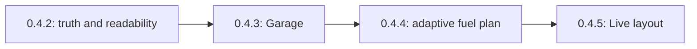

# Apex feedback release milestones

This roadmap turns four user feedback reports into four independently
shippable patch releases. Each release has one primary product outcome, a
bounded rollback surface, focused automated tests, packaged-Windows acceptance,
publication gates, and post-release proof.

The target versions assume `0.4.1` remains the release baseline. If another
release lands first, preserve this order and increment every target version
before implementation. Do not reuse an already published version.

## Release sequence

| Target | Milestone | Feedback outcome | Persistence change | Primary risk |
| --- | --- | --- | --- | --- |
| `0.4.2` | [Truthful and readable race engineering UI](01-v0.4.2-truthful-readable-ui.md) | Completes APX-000004 and the readability portion of APX-000003; establishes APX-000005 trust gates | None | Layout regressions at larger text sizes |
| `0.4.3` | [Local Garage and canonical car history](02-v0.4.3-local-garage.md) | Completes APX-000006 | No schema migration in v1; new read model and IPC only | Incorrectly merging distinct vehicles |
| `0.4.4` | [Adaptive live fuel plan](03-v0.4.4-adaptive-live-fuel-plan.md) | Completes the supportable fuel-only scope of APX-000005 | None; existing local fuel profiles remain compatible | A plausible but wrong pit recommendation |
| `0.4.5` | [Customizable Live dashboard](04-v0.4.5-customizable-live-dashboard.md) | Completes APX-000003 | Versioned local UI preference only | Visual order diverging from keyboard/read order |
| `0.4.6` | [Garage crash containment](05-v0.4.6-garage-crash-containment.md) | Direct user incident follow-up to APX-000006 | None | A private ledger shape remains incompatible |



The sequence is intentionally linear for release evidence and rollback. Code
may be prepared in parallel only if each release branch remains independently
buildable and no later schema or UI contract leaks into an earlier package.

## Evidence baseline

The private 1.7 GB recording was replayed strictly through the current bridge
and decoder. It yielded 422,467 telemetry frames, including 420,046 frames with
vehicle telemetry and 2,421 scoring-only frames. The aggregate audit established:

- fuel, lap progress, timing, pits, refuelling, track identity, distance and
  control-owner transitions are available;
- the decoded contract does not provide an authoritative practice,
  qualifying or race identity;
- track layout was empty in the large recording and approved repository fixture;
- raw vehicle names can contain team, year, livery and car-number decoration;
- the recording included local-player, AI and remote control ownership;
- Virtual Energy allocation, tyre inventory and pit-service configuration are
  not currently decoded.

The recording remains private. Release tests may consume it locally through an
explicit environment variable, but must not commit it, upload it as an artifact,
print identities or paths, or make ordinary CI depend on its presence. CI uses
the approved repository fixture and deterministic synthetic cases.

## Cross-release product invariants

Every milestone inherits these rules:

1. `unknown` is a valid result. Missing session kind, layout, resource or policy
   must not become zero, `race`, a guessed model, or a generated recommendation.
2. Demo data must never appear as measured player data.
3. Replay and imported recordings must not mutate live fuel calibration or
   lifetime driving totals.
4. AI and remote-controlled laps must not become persistent evidence labelled
   as the user's driving.
5. The renderer receives narrow, validated DTOs through preload IPC; it does not
   gain database or filesystem access.
6. English and German rendered copy remain structurally identical.
7. All local data remains local. No account, analytics or new cloud service is
   part of these releases.
8. Bridge changes, if later evidence requires any, retain the packed explicit
   offsets, SDK lock, finite/bounds checks, liveness checks, strict raw replay,
   Windows cross-compile and independent Win32 mapping job.
9. A feedback report is resolved only after its release is published and the
   installed build passes its post-release acceptance. Documentation or a
   merged commit alone is not resolution evidence.

## Common release protocol

Each milestone repeats its feature-specific release checks, but all releases
must also follow this protocol.

### Before implementation

- Start from the exact published predecessor tag and a clean worktree.
- Re-read the complete affected feedback threads and their current revisions.
- Mark only the feedback entering implementation as `in_progress` immediately
  before editing.
- Capture baseline screenshots/tests for the behavior being changed.
- Confirm the milestone's dependencies are present in `HEAD`.

### Before the release commit

1. Run the milestone's focused tests first.
2. Run the complete required repository validation:

   ```bash
   npm ci
   npm run i18n:check
   npm run lint
   npm run build
   npm run build:site
   npm run test:all
   npm run build:bridge:win
   npm audit --audit-level=high
   ```

3. Run every milestone-specific recording, SQLite, UI scaling or Windows test.
4. Bump the root version with `npm version patch --no-git-tag-version` and
   commit both manifests.
5. Add matched English/German content for the exact new version to
   `release-notes/catalog.json`.
6. Run `npm run release-notes:write` and commit the generated changelog.
7. Confirm the release note states known limitations rather than hiding them.

### Push and publish

- Push normally and do not bypass `.githooks/pre-push`. The hook must build the
  Windows installer, portable ZIP, `latest.yml` and `SHA256SUMS.txt` for the
  pushed commit.
- Wait for GitHub `verify`, `windows-bridge-self-test`, any manually required
  packaged-Windows job, and Vercel.
- Do not publish if source, CI, package or manual acceptance disagrees.
- Run `npm run release:publish` only after the verified commit is on `main`.
- Verify the GitHub release contains exactly:
  - `Apex-for-LMU-Setup-X.Y.Z.exe`;
  - `Apex-for-LMU-X.Y.Z-win.zip`;
  - `latest.yml`;
  - `SHA256SUMS.txt`.
- Recompute SHA-256 for the downloaded installer and ZIP and match the published
  checksum file.
- Confirm `HEAD`, `origin/main` and `vX.Y.Z` resolve to the same commit.
- Confirm `https://apex-lmu.openexp.dev` shows the exact version and filenames.

### Installed-release proof

For every release, retain a small proof dossier containing:

- predecessor and target versions and commit SHA;
- focused and full test command results;
- GitHub workflow URLs/statuses;
- installer and ZIP names, sizes and SHA-256 values;
- upgrade path used and whether existing local data was preserved;
- feature-specific acceptance results in English and German;
- known limitations observed after installation;
- final feedback status transitions and resolution summaries.

The dossier may contain aggregate results and screenshots of generated/demo or
privacy-safe UI. It must not contain raw recordings, driver/server identities,
local paths, feedback attachments or private telemetry.

## Deferred capability, not a hidden milestone

These four releases do not promise full LMU race strategy. Virtual Energy,
limited tyre inventory, weather forecast, driver rules, traffic/rejoin
prediction and automatic race-kind detection remain unavailable until an
authoritative field and semantics are established from the pinned official SDK
and verified recordings. If that research succeeds, it should receive a new
separate milestone and release rather than being smuggled into `0.4.4`.
