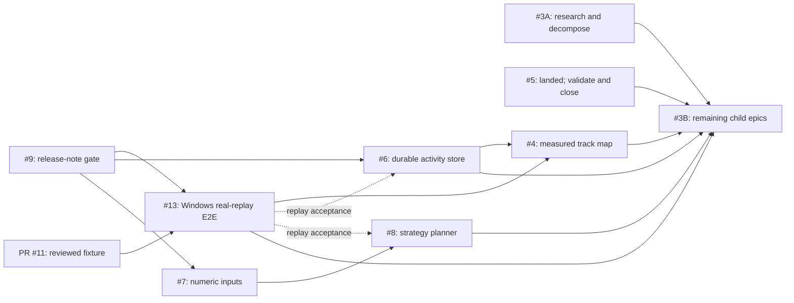

# Open-issue implementation roadmap

This roadmap covers every issue open in
[`ralfboltshauser/apex-lmu`](https://github.com/ralfboltshauser/apex-lmu/issues)
on 2026-07-12: #3–#9 and the newly added #13. The inventory and complete comment
threads were checked through the connected GitHub repository. All eight issues
had zero comments, assignees, and milestones. Issue #13 has `documentation` and
`enhancement` labels; #3–#9 were unlabeled at their verification point.

The plans combine the issue requests, code at commit `9660be5`, repository
invariants, and current primary sources where external behavior matters. An
issue statement is evidence to investigate, not a replacement for code truth.
Two state changes matter for this update:

- issue #13's required 27,407,993-byte real recording is absent from `main` and
  exists only in open draft PR #11, so canonical CI is prerequisite-bound;
- issue #5 remains open, but PR #12 landed its overlay implementation at
  `9660be5` and released it as `v0.1.14`; its remaining roadmap slot is packaged
  Windows validation, gap capture, and issue closure.

## Recommended implementation order

The first column is the recommended merge/closure order, not GitHub issue
number. Work can develop in parallel, but #9 should merge before the next
desktop-impacting release so later releases are forced to carry bilingual
notes. The already-landed #5 work is shown where its validation should complete;
it is not an instruction to reimplement the feature.

| Order | Issue | Deliverable | Status | Complexity | Effort | Risk | Hard dependency |
| ---: | --- | --- | --- | --- | --- | --- | --- |
| 1 | [#9](01-issue-09-multilingual-post-update-changelog.md) | Bundled EN/DE changelog, post-update reveal, release gate | Not started | M | 6–10 days | Medium | None |
| 2 | [#7](02-issue-07-resilient-numeric-inputs.md) | Reusable numeric-field state machine and crash-proof migrations | Not started | S | 2–4 days | Low | None |
| 3 | [#13](03-issue-13-windows-end-to-end-replay-harness.md) | Correlated real-recording replay through bridge, Electron, adapter, and UI | Fixture PR pending | XL | 17–27 days | High | PR #11 fixture; merge after #9 |
| 4 | [#6](04-issue-06-durable-lifetime-driving-statistics.md) | Durable, recoverable lifetime activity ledger and statistics UI | Not started | XL | 20–30 days | High | Merge after #9; #13 is a release-quality soft gate |
| 5 | [#5](05-issue-05-working-multi-display-hud-overlays.md) | Validate landed display-targeted overlay and close or file gaps | Landed in v0.1.14 | XL implementation; bounded closure | 10–15-day implementation already landed | High | Packaged Windows/hardware evidence |
| 6 | [#8](06-issue-08-trustworthy-strategy-planner.md) | One coherent calculated strategy model and explainable UX | Not started | XL | 25–40 days | High | #7; use #13 for replay-integrated acceptance |
| 7 | [#4](07-issue-04-track-map-telemetry-context.md) | Measured track geometry, braking context, and chart cross-linking | Not started | XL | 12–20 days after #6 | High | #6 and #13 |
| 8 | [#3](08-issue-03-premium-feature-program.md) | Bounded premium-grade feature program and remaining child epics | Requires decomposition | XL epic | 55–95 incremental; 122–200 total portfolio | Very high | #4, #5, #6, #8, #13 for completion |

The #3 plan reports an incremental estimate after concrete foundations and a
complete portfolio envelope; do not add both to the linked issues. Its research
slice starts immediately, while implementation converges later. Issue #5's
estimate describes the already-landed scope; validate actual behavior before
estimating only the remaining gaps.

## Total engineer-day estimate

Use the **incremental** #3 estimate in an issue-by-issue sum. Its 122–200 day
portfolio envelope already contains #4, #5, #6, and #8, so adding that envelope
to those four issue estimates would double-count them.

| Issue | From-scratch estimate | Remaining estimate at `9660be5` | Counting note |
| --- | ---: | ---: | --- |
| #9 | 6–10 | 6–10 | No implementation landed |
| #7 | 2–4 | 2–4 | No implementation landed |
| #13 | 17–27 | 17–27 | Excludes waiting for PR #11 publication approval |
| #6 | 20–30 | 20–30 | No implementation landed |
| #5 | 10–15 | 2–5 | Core implementation shipped in v0.1.14; remaining range is packaged/hardware validation, gap triage, and closure |
| #8 | 25–40 | 25–40 | Includes #7 integration work but not #7's component implementation |
| #4 | 12–20 after #6 | 12–20 after #6 | Use 18–28 only if built without #6's substrate |
| #3 remainder | 55–95 | 55–95 | Incremental Tranches B–H after reusing #4/#5/#6/#8 |
| **Total without double-counting** | **147–241** | **139–231** | Midpoints: roughly 194 from scratch or 185 remaining |

Equivalent cross-check: the #3 full portfolio is 122–200 days and already
contains #4/#5/#6/#8. Adding the independent #9, #7, and #13 estimates gives
the same from-scratch total: `122–200 + 6–10 + 2–4 + 17–27 = 147–241`.

These are engineer-days, not elapsed calendar days. At a planning assumption of
220 productive engineer-days per year, the remaining work is about **0.63–1.05
single-engineer years** before review/waiting overhead. Multiple engineers can
shorten elapsed time along the parallel paths below, but dependencies, Windows
hardware validation, and integration prevent dividing the total linearly by
team size.

## Parallel execution topology



Suggested ownership for a multi-engineer team:

| Track | Phase 0 | Phase 1 | Phase 2 |
| --- | --- | --- | --- |
| Release and UI correctness | #9 and #7 in parallel; merge #9 first | Support #8 integration | Cross-view accessibility pass |
| Windows validation | Review PR #11; design #13 protocol | Build bridge/Electron/UI harness | Make stable CI required; packaged smoke |
| Local data platform | #6 schema/driver spike | #6 ledger, migration, recovery, statistics | #4 lap and geometry storage |
| Desktop runtime | Validate landed #5 on packaged Windows | Close #5 or file bounded gaps | Consume #13 for desktop regression coverage |
| Race engineering | #3 capability research | #8 calculated candidates and explanations | #4 braking analysis; remaining #3 epics |

The likely critical path is `#9 → #13 → #6/#4 → remaining #3 work`, with #6's
schema and persistence work beginning while #13 is built. The strategy path
`#9 → #7 → #8` runs alongside it. Issue #5 validation should happen early
because its implementation is already shipped, but real multi-monitor,
fullscreen, and DPI evidence cannot be supplied by a single-display CI VM.

## Complexity ranking

Complexity combines implementation size, cross-process reach, data migration,
validation burden, and uncertainty—not just lines of code. Equal `XL` ratings
are ranked by expected coupling and research risk.

| Rank, easiest first | Issue | Rating | Why |
| ---: | --- | --- | --- |
| 1 | #7 | S | Two current call sites and a bounded reusable component contract |
| 2 | #9 | M | Crosses UI, startup state, packaging, publishing, and release policy |
| 3 | #5 | XL implementation, bounded closure | Cross-platform Electron lifecycle was large, but code has landed; remaining work is evidence and gap triage |
| 4 | #13 | XL | Real raw bytes cross Go, process lifecycle, IPC, adapter, React, Windows CI, packaging, and privacy boundaries |
| 5 | #8 | XL | Existing UI presents contradictory outputs; engine and product semantics must be unified |
| 6 | #6 | XL | User-history durability, identity, idempotency, migrations, backups, recovery, and source ownership |
| 7 | #4 | XL | Requires verified SDK fields, real lap ingestion, geometry construction, linked interaction, and #13 acceptance |
| 8 | #3 | XL epic | Undefined scope spans multiple products' portfolios and incompatible cloud assumptions |

Scale used by every issue plan:

| Rating | Normal meaning |
| --- | --- |
| XS | At most one day; isolated and mechanically verifiable |
| S | 2–4 engineer-days; narrow surface and low uncertainty |
| M | 5–10 engineer-days; several layers or a modest migration |
| L | 10–20 engineer-days; cross-process or platform-specific behavior |
| XL | More than 20 days, a foundational data change, or substantial research uncertainty |

An effort range includes code, focused tests, EN/DE copy, documentation, and
issue-specific validation. It excludes waiting for real LMU sessions, hardware,
fixture-publication approval, and external review.

## Phase and release plan

### Phase 0 — trust gates

1. Land #9 as a bootstrap release with its own complete EN/DE note.
2. Land #7 and remove numeric-field render failures before changing strategy.
3. Review PR #11's privacy/publication decision and exact fixture checksum.
4. Build #13's strict correlated replay path and source desktop harness. Start
   the job non-required, collect duration/flake evidence, then make it required
   for relevant desktop/bridge changes.
5. Validate shipped #5 on packaged Windows and close it or create precise gap
   issues—do not keep an ambiguous open issue after release.
6. Time-box #3's market/capability research and decompose the undefined remainder
   into independently testable child issues.

### Phase 1 — parallel product foundations

- Build #6's main-process activity store and prove upgrade/recovery behavior;
  use #13 to verify replay never mutates lifetime totals.
- Replace #8's hard-coded cards with candidates from the deterministic engine;
  use #13 only for the integration facts the recording actually contains.
- Harden #13's packaged smoke and negative controls as these products exercise
  more of the UI.

Ship product foundations separately so rollback and field diagnosis remain
tractable and the #9 changelog stays useful.

### Phase 2 — spatial analysis

Build #4 on #6's durable session identity/storage and #13's verified real replay
path. A first release may show a measured distance strip if confirmed two-
dimensional geometry is unavailable. It must never substitute the demo circuit
shape in a measured session.

### Phase 3 — premium-grade portfolio

Use #3 as a tracking epic. Finish linked issues, then implement only remaining
capabilities that pass local-first, availability, provenance, licensing, test,
and user-value gates. Cloud collaboration, copied setup packs, and unlicensed
reference laps are not implicit requirements.

## Global engineering gates

Every issue plan inherits these rules:

- Generated/demo values are never presented as measured player data.
- Missing LMU fields remain `unknown`; zero is not a substitute for absence.
- Scoring may arrive before vehicle telemetry; gradual capability arrival is
  correct and must be represented explicitly.
- Demo, self-test, and replay sources cannot silently mutate lifetime totals.
- Raw recordings remain private and are never uploaded as logs/artifacts.
- Renderer access stays behind narrow, validated preload methods.
- Rendered copy is structurally matched in English and German.
- Bridge changes preserve explicit offsets, bounds/finite checks, SDK locking,
  producer liveness, raw replay, and the independent real Windows mapping job.
- Data migrations are forward-only, transactional, backed up before mutation,
  and fail closed with a recovery path.
- E2E success requires correlated completion and clean teardown; process exit 0
  or stale output alone can never pass.
- Desktop-impacting releases obey the version synchronization and pre-push
  invariant in `AGENTS.md`.

Before publishing a normal implementation tranche, run the focused test first
and then the required repository validation:

```bash
npm ci
npm run i18n:check
npm run lint
npm run build
npm run build:site
npm run test:all
npm run build:bridge:win
npm audit --audit-level=high
```

Issue #4 requires the complete Win32 mapping/fixture path, real-header review,
and the #13 real-recording path. Issues #5 and #6 require packaged Windows
upgrade/lifecycle evidence that Linux tests cannot replace. Issue #13 must keep
the synthetic live mapping and real recording jobs distinct.

## Coverage index

- [Issue #9 — multilingual post-update changelog](01-issue-09-multilingual-post-update-changelog.md)
- [Issue #7 — resilient numeric inputs](02-issue-07-resilient-numeric-inputs.md)
- [Issue #13 — reusable Windows end-to-end replay harness](03-issue-13-windows-end-to-end-replay-harness.md)
- [Issue #6 — durable lifetime driving statistics](04-issue-06-durable-lifetime-driving-statistics.md)
- [Issue #5 — working multi-display HUD overlays](05-issue-05-working-multi-display-hud-overlays.md)
- [Issue #8 — trustworthy strategy planner](06-issue-08-trustworthy-strategy-planner.md)
- [Issue #4 — track-map telemetry context](07-issue-04-track-map-telemetry-context.md)
- [Issue #3 — premium feature program](08-issue-03-premium-feature-program.md)
